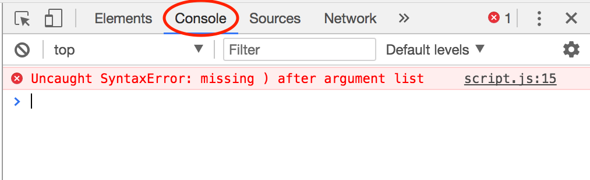

# canvas

[View the lecture notes](/lectures/week4)

[View the example code](/homework/canvas/example)

## Assignment

Use javascript and the canvas to draw a picture.

Requirements:
- Your HTML file should include the following:
  - Title
  - Favicon made from a screenshot of your picture
  - The following working meta tags
    - `og:type`
    - `og:title`
    - `og:description`
    - `og:url`
    - `og:image`
- Your drawn image should include at least the following:
  - One rectangle, drawn with `ctx.strokeRect()` or `ctx.fillRect()`
  - One circle or curve, drawn with `ctx.arc()`
  - One polygon, drawn with `ctx.moveTo()` and `ctx.lineTo()`

Upload the following to `students/<yourname>/canvas/` by 8am on Monday, April 30
- `index.html`
- a `css` file to remove the page's default margins
- a `js` file for drawing the picture

## Canvas Tips
- Guide on how to use [<canvas>](canvas.md)
- Strings, like colors and hex codes, needs quotes around them like `"this"`, but variable names like `canvas` and numbers don't need quotes
- Totally stuck? Try inspecting the page and checking the Console for errors:

## Meta Tips
- You can view the [pink site's source code](https://github.com/mpaulweeks/cfc2018/blob/master/index.html) as an example
- Use this [Facebook debugger site](https://developers.facebook.com/tools/debug/sharing) to verify
  - You can only test this after uploading, your local URL won't work
  - Remember, it can take a couple minutes for your uploaded changes to appear live, and then you have to Scrape Again
- Use the same title for your HTML <title> and the meta title
- Image urls have to be absolute, ie with the "http://" beginning
